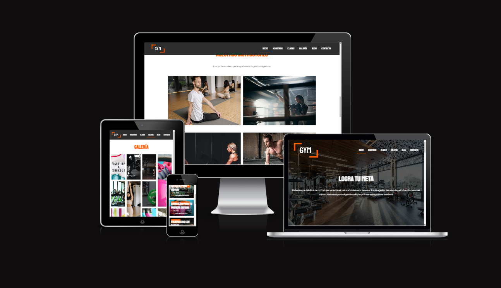

# Urban-Fitness

## Descripción

Urban Fitness es un proyecto de desarrollo de un sitio web para un gimnasio. El objetivo principal es crear una plataforma en línea que permita a los usuarios obtener información sobre el gimnasio, sus servicios, actividades, y sus en clases y además obtener recursos relacionados con el fitness en su blog.

## Características Destacadas

- Custom Post Types: He implementado tipos de publicaciones personalizadas para gestionar fácilmente contenido como clases, entrenadores y testimonios.

- Plugins Personalizados: He creado dos plugins personalizados para ampliar las funcionalidades del sitio.

- APIs de Widgets, Plugins y Shortcodes: A lo largo del proyecto, he utilizado Widgets API, Plugin API y Shortcode API para agregar componentes y funcionalidades personalizadas.

- Diseño Responsivo y Mobile First: El sitio web se ha desarrollado con un diseño totalmente receptivo y enfoque "mobile first" utilizando Flexbox y CSS Grid para garantizar una experiencia óptima en dispositivos móviles y de escritorio.

- Advanced Custom Fields: He utilizado el plugin Advanced Custom Fields para permitir la personalización de contenido y opciones del tema de manera sencilla.

## Tecnologías Utilizadas

## Proyecto Desplegado

🚀​ https://dev-urbanfitness.pantheonsite.io/ 🚀​
